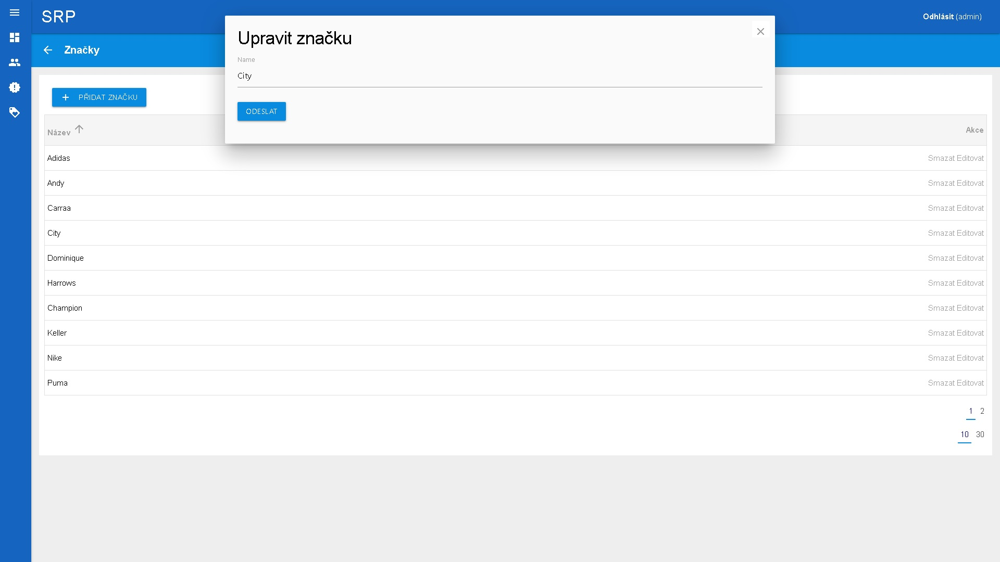
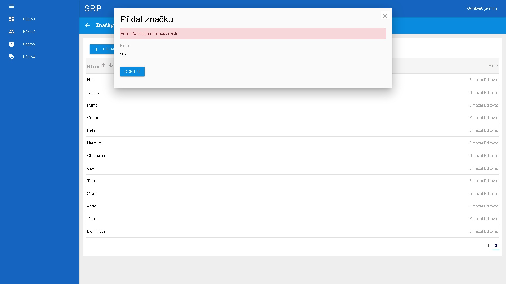
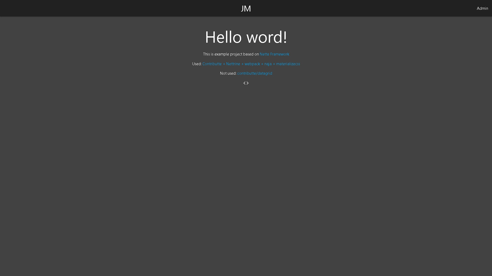

## Goal
Create a basic application for working with forms and datagrid on Conttributte.

Focused on:

- PHP >= 8.0, <8.2
- form / action (create, edit, delete)
- datagrid (pagination, limit, sorting)
- materializecss template
- merge & bug fix

Used:

- <a href="https://contributte.org">contributte</a> webapp skeleton, nettrine, webpack
- <a href="https://materializecss.com/">materializecss</a>


## Demo

https://nette.janmikolas.cz/

login: test@test.cz
password: test


### Install 

1) To install latest version of `janmikolas/webapp-nette` use [Composer](https://getcomposer.org).

   ```
   composer create-project -s dev janmikolas/webapp-nette acme
   ```
   
2) Modify `config/local.neon` and set host to `database`

   Default configuration should look like this:

   ```neon
   # Host Config
   parameters:
	   # Database
	   database:
		   host: localhost
		   dbname: jm_webapp
		   user: webapp
		   password: webapp
   ```

2) Modify `config/app/parameters.neon` and set driver to `database`

   Default configuration should look like this:

   ```neon
   # Database
   database:
	   driver: mysqli
	   port: 3307
   ```

3) Modify `webpack.config.js` and set `publicPath` (not required)

   Default configuration should look like this:
   ```
   publicPath = '/dist/'
   ```

4) Import `db/db.sql` to `database`

5) Clean cache dir `var/tmp/cache` (not required)

6) Drop tables (not required)
   ```
   php bin/console orm:schema-tool:drop  --dump-sql --force
   ```

7) Create tables (not required)
   ```
   php bin/console orm:schema-tool:update  --dump-sql --force
   ```
   
8) Insert fixtures data (not required)
   ```
   php bin/console doctrine:fixtures:load  --append
   ```

9) Install assets
   ```
   # (if exist node_modules rmdir node_modules /q /s) && npm install
   npm install
   ```

10) Build assets
   ```
   npm run start
   ```
   
   
## Screenshots



